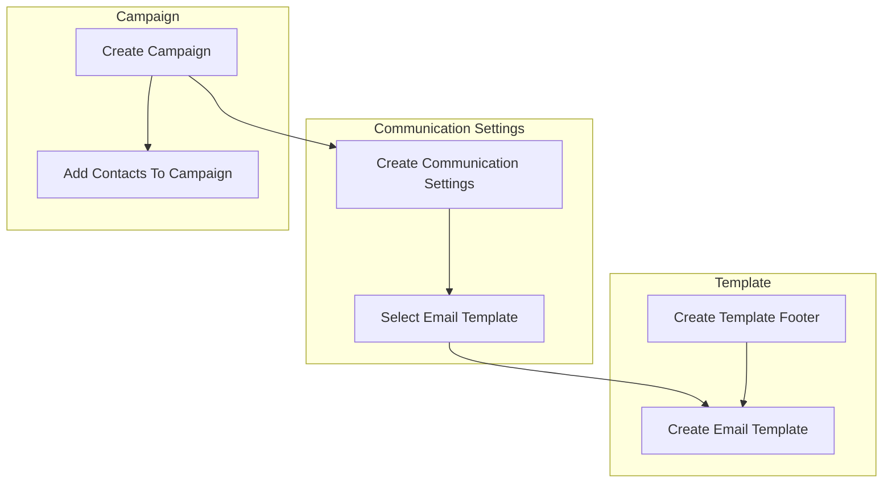
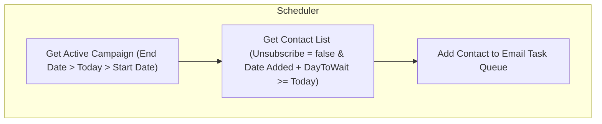

# Campaign Workflow
A service for automating communicating with anyone
Problem Domain:
Automate what, who and when to send email communications.


## Creating a new campaign
The steps to creating a new communication campaign



## Communication Settings
The communication settings workflow



## Email Activity Tracking
The workflow for controlling email activity
```mermaid
graph TB

subgraph Send Email
S1["Send Email & Update Sent=true"] --> S2["Track Email"] --> S3{"Is email opened?"} --> S4["Yes"] & S5["No"]
end