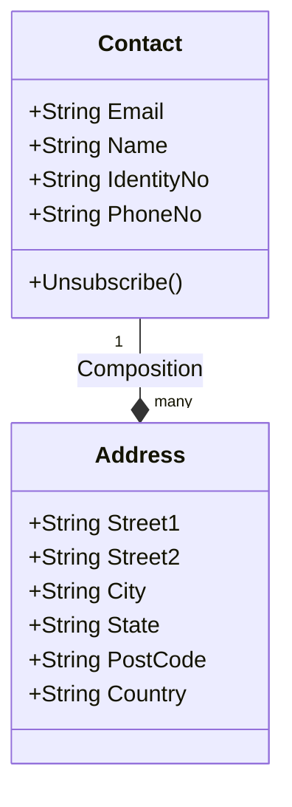
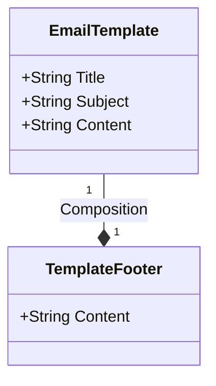
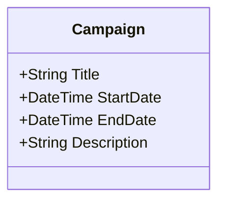
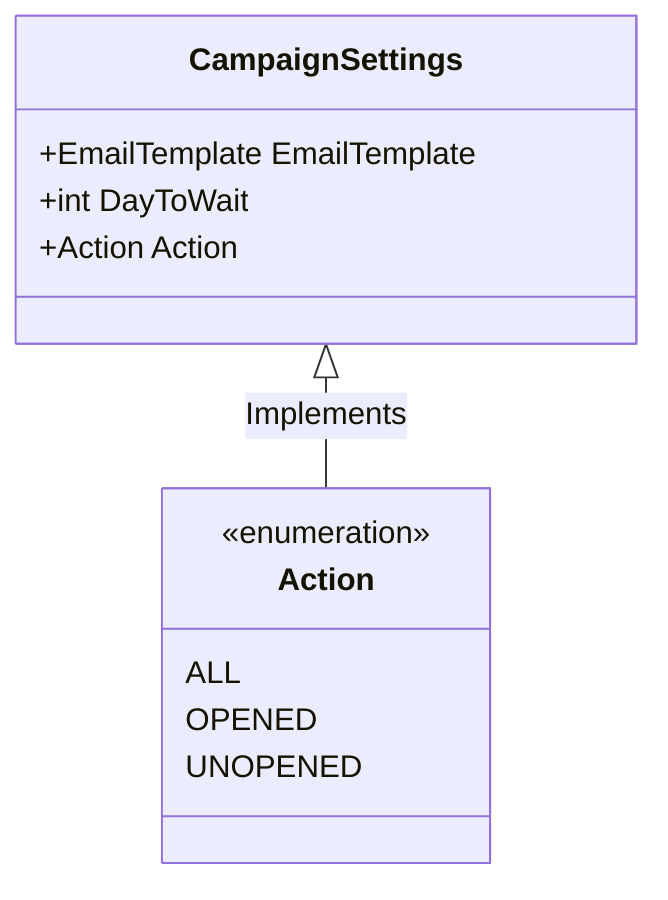
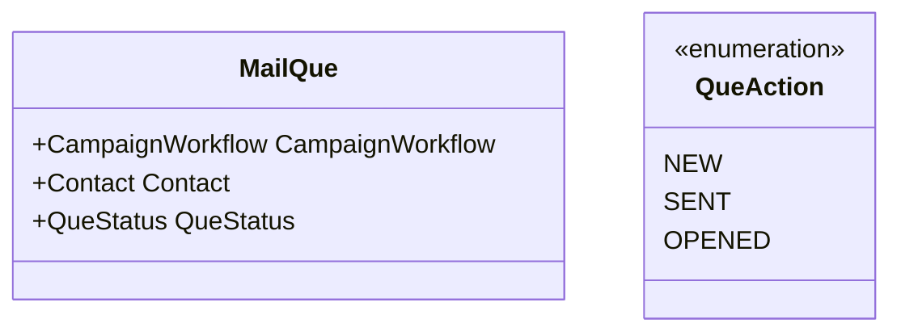

# Email Campaign Service Domain Models

### Contacts
The persons that we want to communicate with

### Email Template
The communication content to be sent to the contacts

### Campaign
The main entry point for setting up the communication campaign

### Campaign Settings
The behaviour and communication plans for the campaign

### Email Task
The queue to track emails to be sent

