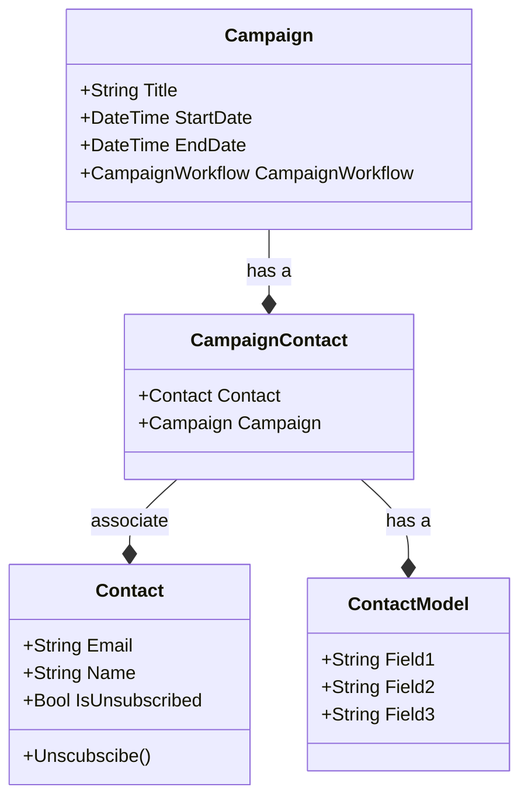
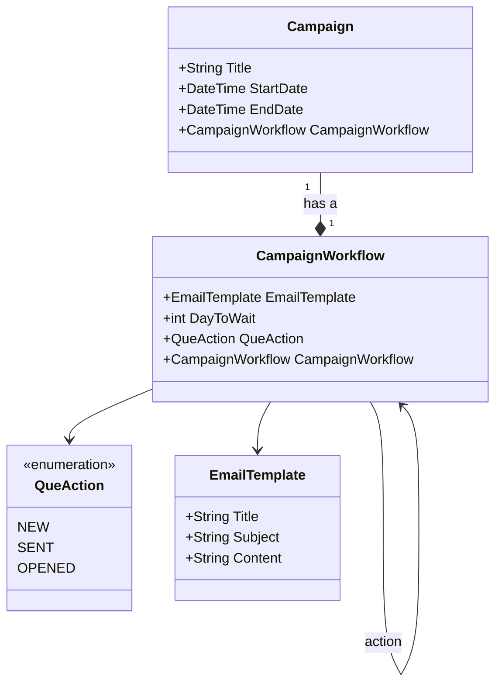
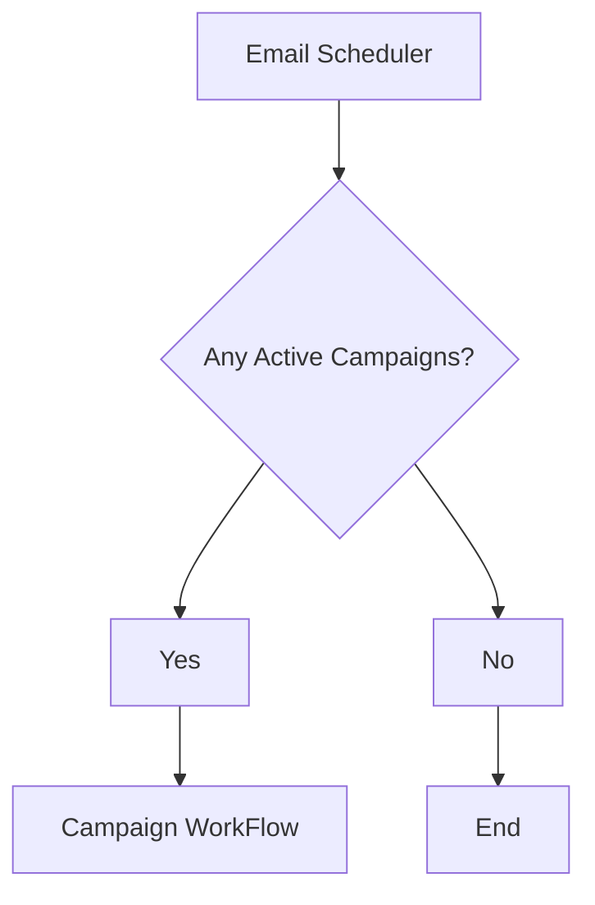
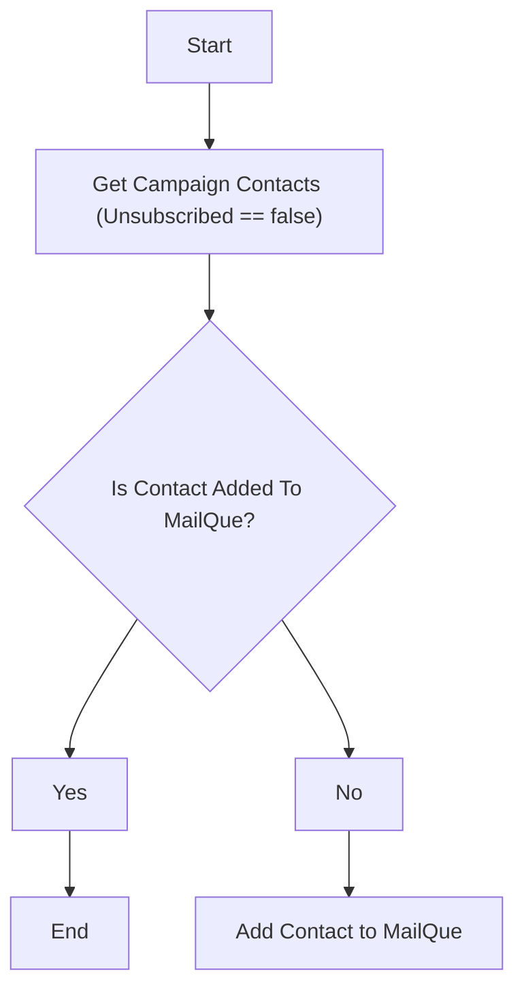

# Email Campaign Service Domain

The Problem Domain:
1. Who to send
2. What to send
3. When to send

Campaign -> stores the details of who, what and when to send. \
CampaignContact -> stores the contacts linked to the campaign. \
Contact -> the master list of all contacts for the entire application. \
ContactModel -> Additional information that will be used by the email template to personalize the email communication

### Campaign Detail

## Email Communication Workflow
Once the campaign is setup, the email scheduler will trigger the communication tasks

### Email Scheduler

### Campaign Workflow
Campaign Workflow determines the what and when to send, creates the task queue for actual sending of the emails

### Reference:
Mermaid JS
Class Diagrams: [https://mermaid-js.github.io/mermaid/#/classDiagram]